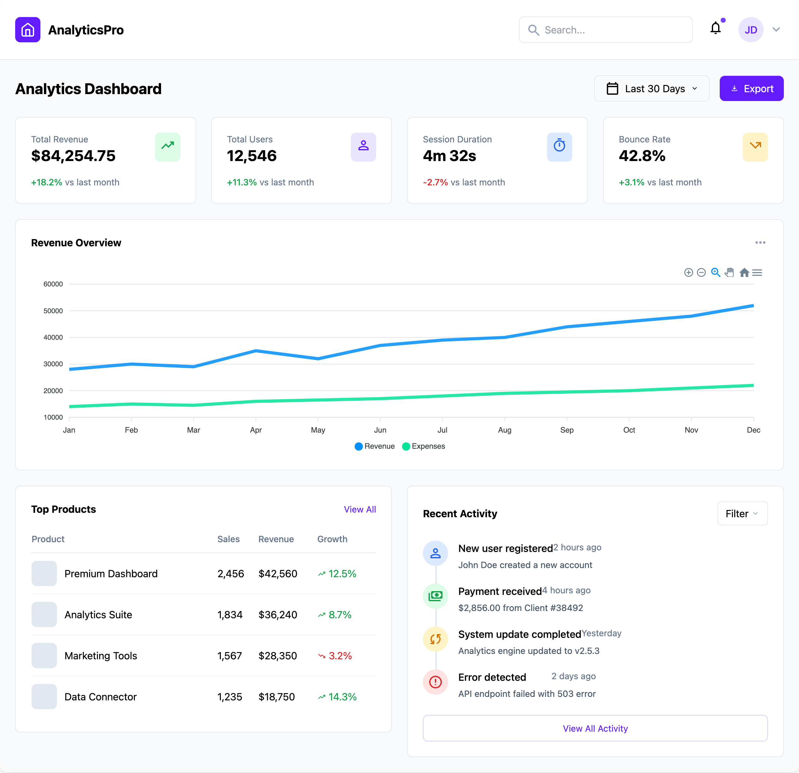
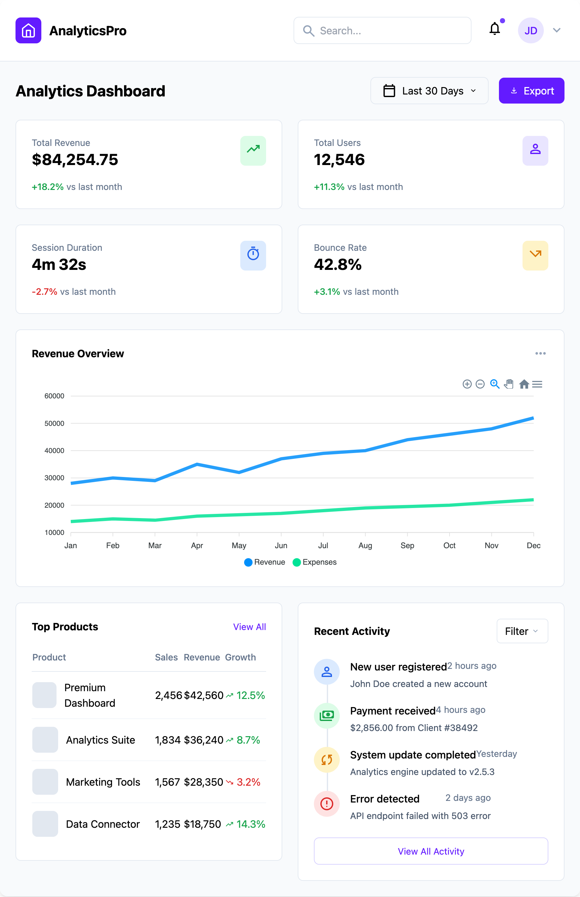
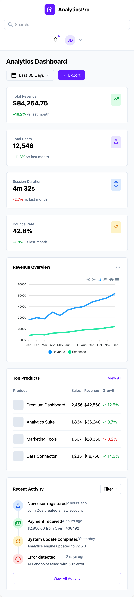

# 📊 Angular Dashboard Project

A modern and responsive dashboard built with **Angular 19**, **Tailwind CSS**, and **ApexCharts**.  
Designed to showcase clean UI, responsive layouts, and dynamic data visualization.

---

## ✨ Features

- **Angular 19** with **Standalone Components** 🛠️
- **Tailwind CSS** styling for utility-first and responsive design 🎨
- **ApexCharts** integration for smooth charts 📈
- **Fully Responsive**: Works beautifully on desktop, tablet, and mobile 📱
- **Component-Based Architecture**: Modular and scalable 📦
- **Modern UI**: Clean and minimal dashboard layout ✨

---

## 🏗️ Project Structure

```
src/
├── app/
│   ├── components/
│   │   ├── header/
│   │   │   ├── header.component.ts
│   │   │   └── header.component.html
│   │   ├── revenue-chart/
│   │   │   ├── revenue-chart.component.ts
│   │   │   └── revenue-chart.component.html
│   │   ├── stat-card/
│   │   │   ├── stat-card.component.ts
│   │   │   └── stat-card.component.html
│   │   ├── top-products/
│   │   │   ├── top-products.component.ts
│   │   │   └── top-products.component.html
│   │   └── recent-activity/
│   │       ├── recent-activity.component.ts
│   │       └── recent-activity.component.html
│   ├── app.component.ts
│   ├── app.component.html
│   └── styles.css
├── tailwind.config.js
└── postcss.config.js
```

---

## 🚀 Getting Started

1. **Clone the repository**

```bash
git clone https://github.com/MariannSz/angular-dashboard-project.git
cd angular-dashboard-project
```

2. **Install dependencies**

```bash
npm install
```

3. **Run the development server**

```bash
ng serve
```

Open [http://localhost:4200](http://localhost:4200) to see the app in action!

---

## 📦 Built With

- [Angular](https://angular.io/)
- [Tailwind CSS](https://tailwindcss.com/)
- [ApexCharts](https://apexcharts.com/)

---

## 📸 Screenshots

|                        Large                         |                        Medium                         | Small                                                |
| :--------------------------------------------------: | :---------------------------------------------------: | ---------------------------------------------------- |
|  |  |  |

---

---

## 📄 License

This project is open source and available under the [MIT License](LICENSE).
